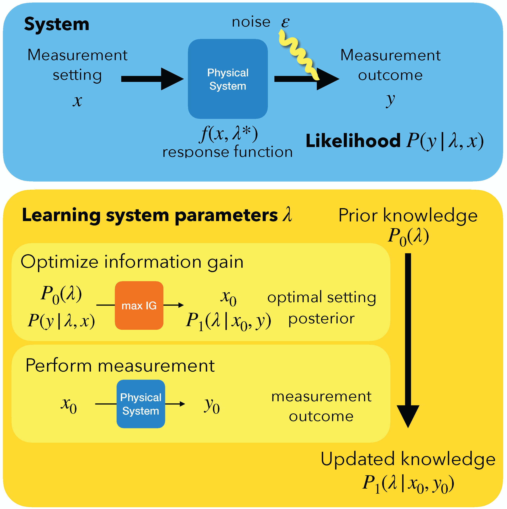

# Deep Bayesian Experimental Design for Quantum Many-body Systems



This repository provides the research code developed for the experiments shown in the paper _"Deep Bayesian Experimental Design for Quantum Many-body Systems"_ by Leopoldo Sarra and Florian Marquardt.

## Installation

- git clone this repository
- install the requirements
    - `numpy, scipy, tensorflow, matplotlib, tqdm `  
    - for example, run from this folder:
        ``` pip install -r requirements.txt ```
- install the package with `pip install -e .`


## Usage

Please refer to:
- `notebook.ipynb` for running experiments
- `output-analysis.ipynb` for analyzing previously run experiments

In particular, to **run a new experiment**:
- load the configuration, if desired, or define it manually:
```python
    cfg.merge_from_file(config_path)
```
- define a system
```python
    system = al.systems.get_system_from_name(cfg.SYSTEM.TYPE)(
                dim_lambda=cfg.SYSTEM.DIM_LAMBDA,
                type_lambda=cfg.SYSTEM.TYPE_LAMBDA,
                real_lambda=cfg.SYSTEM.REAL_LAMBDA,
                sigma_noise=cfg.SYSTEM.SIGMA_NOISE,
                x_range=cfg.SYSTEM.X_RANGE,
                j_coupling=not cfg.SYSTEM.COUPLING_RANDOM and cfg.SYSTEM.COUPLING,
                n_counts=cfg.SYSTEM.BINOMIAL.N_COUNTS)
```

- define the learner
```python
learner = al.learners.BayesLearner.from_default(system)
```

- define the advisor
```python
    advisor = al.advisors.get_advisor_from_name(cfg.ADVISOR.NAME)(
        learner=learner,
        starting_x=0,
        n_train=cfg.ADVISOR.N_TRAIN,
        batch_size=cfg.ADVISOR.BATCH_SIZE,
        parallel=parallel)
```

- define initial label (where to save the checkpoints)
```python
    label = f"{cfg.PATH.SUBLABEL}-{len(learner.history):03d}"
```
- save the first checkpoint for the initial state
```python
    al.utils.save_all(al.utils.h5_get_model_path(label), system, learner, advisor)
```

The training loop consists in:
- suggesting a new measurement
- (evaluating the metrics)
- applying the measurement and updating the prior

```python
for i in range(cfg.TRAINING.N_MEASUREMENTS):
    label = f"{cfg.PATH.SUBLABEL}-{len(learner.history)+1:03d}"
    al.logger.info(f"Starting measurement {len(learner.history)+1:03d}")

    tf_measure_x = advisor.suggest_next_measurement()
    tf_measure_y = tf.convert_to_tensor(system.measure(tf_measure_x), K.backend.floatx())
    learner.metrics.evaluate(tf_new_y_measure=tf_measure_y)

    learner.apply_measurement(tf_measure_x, tf_measure_y)
    al.utils.save_all(al.utils.h5_get_model_path(label), system, learner, advisor)
```


## Implementation details

Each instance of a model is composed by three elements: 
- the system, which represents the physical system about which we want to learn the parameters
- the learner, which implements the Bayesian formalism and keeps track of the parameter distribution and of the measurement history
- the advisor, which implements the measurement strategy (e.g. active, random, etc.) and handles the posterior optimization

All the most important parameters of a run are stored in a config file inside the `configs` folder. To run a new experiment, it is enough to specify a configuration file.
Results are stored in the `outputs` folder in a new folder with the chosen label.
Each run saves checkpoints after each measurement in the `models` folder and logs in the `logs` folder.

We used to run the experiments using the SLURM job scheduler. We used the `run.ipynb` notebook as a helper for this purpose.
This is also the reason why we employed `ipyparallel` to facilitate parallelization among cluster nodes (indeed, for the active strategy, it is helpful to run the optimization multiple times from different initial values of `x` to avoid getting trapped in local minima). This setting can be disabled with the flag `config.PARALLEL.ENABLED = False`. The included sbatch files are examples of engine and controller configuration settings for the ipyparallel profile. We decided to employ `papermill` to run notebooks from command line, but this is definitely not a requirement if you wrap the code in `notebook.ipynb` into a script.

An experiment on a new physical system can be created by implementing a new instance of the `System` class.

The code has been tested on Python 3.9.

---
## Citation
If you find this code useful in your work, please cite our article
_"Deep Bayesian Experimental Design for Quantum Many-body Systems"_, Leopoldo Sarra, Florian Marquardt, arXiv:2306.14510 

available on

https://arxiv.org/abs/2306.14510 

This work is licensed under a MIT License.
